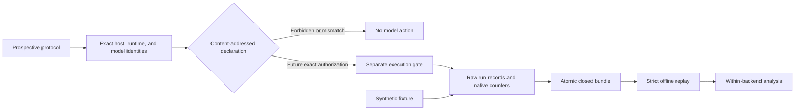

# LocalInferenceLab

**Evidence-first determinism experiments for local LLM inference on Apple Silicon.**

LocalInferenceLab treats repeatability as a provenance and custody problem. It binds exact inputs,
runtime and model identities, process and model instances, cache-preparation lineage, effective
concurrency, exact execution order, native metrics, and raw outputs before it compares runs. It is
not a tokens-per-second leaderboard and it does not infer determinism from a seed.

> The foundation release contains no live model runner. Its complete synthetic fixture exercises
> contracts, analysis, durable publication, and offline replay without a model, network request, or
> download.

## Trust boundary



The current `G` node is intentionally absent. Backend surfaces only hash preinstalled artifacts and
produce non-executable plans. There is no environment-variable bypass, localhost call, runtime
startup, model pull, or implicit authorization path. Future observed records must account for every
process start and inference request within the declaration budget.

## Benchmark matrix

| Surface | MLX-LM | llama.cpp with Metal | Ollama |
|---|---|---|---|
| Runtime identity schema | Package or immutable install manifest plus structured runner and Metal facts | Binary digest, build version, commit, runner, and Metal state | Binary or package digest, version, selected internal runner, and Metal state |
| Model identity schema | Snapshot file manifest, config, tokenizer | GGUF bytes and metadata | Manifest and layer digests |
| Cache cohort contract | Prompt and KV cache state | Process, model, prompt/KV, context shift | Outer API state plus active runner and cache state |
| Native metrics | Preserved when exposed | Preserved when exposed | Durations and token counts in native nanosecond units |
| Live execution in v1 | Forbidden | Forbidden | Forbidden |
| Synthetic fixture | Exact repeat group | Text and token divergence group | Plan and identity adapter only |

MLX snapshots, GGUF files, and Ollama manifests are separate representations. A shared marketing
name does not establish byte or behavioral equivalence. Cross-representation equivalence remains
`unproven` in v1. Mapping digests and mapped states are rejected until a typed, indexed mapping
artifact contract exists.

## Quickstart

Python 3.12 or newer and [uv](https://docs.astral.sh/uv/) are required.

```bash
uv sync --locked --all-groups
mkdir -p .artifacts
uv run localinferencelab fixture compile .artifacts
uv run localinferencelab bundle replay .artifacts/localinferencelab-fixture-v1-*
```

The committed fixture deterministically produces:

| Result | Value |
|---|---:|
| Bundle content root | `sha256:c4401fe71dee474a610eb95cf071fea72a0c09a3b221d80bd023c603f618617e` |
| Protocol identity | `sha256:a23da6973f43faa2a9ae5e3d9bb912a43434f185507760e9363689956dfa5df5` |
| Runs | 4 |
| Exact scheduled slots | 4 |
| Isolated cache cohorts | 2 |
| Exactly repeatable groups | 1 |
| Divergent text/token groups | 1 |
| Model, network, and download actions | 0 |

These are synthetic contract results, not benchmark claims about hardware, a model, or a backend.

## CLI

```text
localinferencelab contract verify RECORD.json
localinferencelab fixture compile OUTPUT_ROOT
localinferencelab bundle verify BUNDLE
localinferencelab bundle replay BUNDLE
localinferencelab host probe
localinferencelab backend plan {mlx-lm,llama.cpp,ollama}
localinferencelab backend probe BACKEND ARTIFACT --version VERSION [--commit COMMIT]
```

`host probe` is read-only and excludes usernames, home paths, hostnames, serial numbers, and UUIDs.
Linux output is portability evidence only and never claims Apple Silicon eligibility. `backend
probe` hashes one no-follow file descriptor without executing it and records only its basename.
Static probes remain explicitly incomplete until backend-specific observed capability evidence
exists. Literal absence markers such as `unobserved`, `unknown`, and `unavailable` never satisfy an
observed identity requirement.

## Measurement semantics

- Exact repeatability compares raw response, UTF-8 text, observable token IDs, finish reason, and
  structured envelope digests inside one backend, identity set, protocol, process instance, model
  instance, cache preparation, effective concurrency state including peer request shape, request,
  and cache cohort. The exact schedule separately binds ordered concurrency waves.
- A valid output requires a finish reason. Missing token IDs make the group `not_comparable`;
  invalid output makes it `incomplete`. Neither state is reported as exact or divergent.
- Performance keeps backend-native names and units. Derived throughput is integer fixed-point and
  only exists when generation count and duration are available.
- TTFT, prompt evaluation, generation, total, and load measurements carry explicit availability
  reasons. Missing values are not synthesized.
- Memory is recorded only with a named method. Process RSS is never labeled Metal or GPU memory.
- Energy is unavailable in v1 because no privileged reviewed protocol exists.
- Cross-backend output is descriptive and identity-aware. It is not a superiority ranking or an
  equivalence claim.

## Durable custody

Bundles contain source fixture intent, protocol and exact run schedule, identities, process/model
instances, cache-preparation lineage, concurrency identity, declarations, eligibility decisions,
ordered run records, analysis, index, and receipt. Publication uses fsynced staged files, fsynced
directories, a platform no-replace rename, destination-parent fsync, and receipt-last exclusive
creation. Replay opens a verified bundle-root descriptor, traverses each component relative to
directory descriptors with no-follow and nonblocking flags, requires regular files before reading,
and rejects symlinks, traversal, special files, non-canonical JSON, unknown keys, identity drift,
extra or missing paths, swapped records, schedule drift, writable or foreign-owned bundle
directories, action-budget drift, source-intent drift, analysis drift, and absent receipts. Digest
and semantic checks use the same single-read byte snapshot.

See [Architecture](docs/architecture.md), [Protocol](docs/protocol.md), and
[Current source research](docs/research/current-sources.md).

## Exact non-claims

The project does not claim that:

- a fixed seed proves determinism;
- synthetic metrics describe real Apple Silicon performance;
- MLX, GGUF, and Ollama representations are the same model;
- CUDA deterministic-mode work applies to Metal;
- process RSS measures GPU memory or energy;
- one backend is faster, more stable, or more accurate than another.

## Roadmap

1. Review and freeze the v1 records and execution declaration.
2. Add separately authorized, preinstalled-resource runners one backend at a time.
3. Capture observed backend-specific cache lifecycle evidence and tokenizer identity.
4. Publish observed Apple Silicon bundles only after provenance and privacy review.
5. Define a typed, indexed mapping-artifact protocol before any mapped cross-representation study.

## Development

```bash
make validate
```

Validation formats and lints, type-checks in strict mode, runs adversarial tests with coverage,
builds an offline sdist and wheel, compiles the fixture, and replays the published bundle.

Apache-2.0. Contributions must preserve the fail-closed execution boundary.
