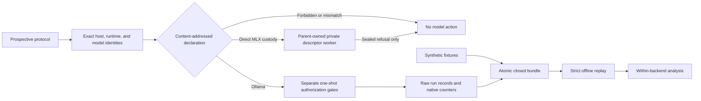

# LocalInferenceLab

**Evidence-first determinism experiments for local LLM inference on Apple Silicon.**

LocalInferenceLab treats repeatability as a provenance and custody problem. It binds exact inputs,
runtime and model identities, process and model instances, cache-preparation lineage, effective
concurrency, exact execution order, native metrics, and raw outputs before it compares runs. It is
not a tokens-per-second leaderboard and it does not infer determinism from a seed.

> The Ollama runner is implemented but fail-closed. It can prepare and verify exact prospective
> packages offline and perform separately authorized read-only loopback preflight calls. The
> additive `ollama_repeatability_study_declaration` schema 1.0 freezes the planned Qwen3 study
> without probing Ollama or precreating a host-bound output marker. The additive schema-1.0
> attestation assessment now records the reviewed result: public nonprivileged macOS and Ollama
> surfaces are **insufficient** to content-bind the exact accepted connection and request to one
> stable listener process and active runner/model/Metal instance through response. Observed
> generation and replay therefore remain disabled. Repository tests and recorded evidence use
> no-socket fixtures: they do not contact Ollama, inspect a live process, execute a model, or make
> a benchmark claim.
>
> The direct MLX milestones avoid that listener gap with a parent-owned private-descriptor worker.
> Strict additive schema-1.0 records bind a complete explicitly supplied package-root byte
> closure, raw dependency metadata, supplied model-root bytes and present weight projection, worker
> bytes, a closed environment, finite protocol design, exact controls, result semantics, and future
> custody. A separate inert-custody schema now exercises the real POSIX process, exact FD 3 private
> socket, canonical finite exchange, one-shot refusal authorization, physical output-root binding,
> terminal wait, closed publication, and process-free replay. The sealed worker can only return
> `mlx_execution_unimplemented_and_unauthorized`; no generated-result producer exists. These
> records do not prove
> applicable dependency semantics, Python standard-library/native-loader closure, or a production
> generated-result implementation. The model manifest binds supplied bytes
> and exact present canonical shard projections, not semantic parameter key/shape completeness;
> future pinned strict-load evidence is also an explicit blocker.
> The deliberately explicit `mlx custody-self-test` command remains refusal-only. The separate
> runtime-preflight protocol implementation remains covered by sealed synthetic tests, but public
> schema-1.0 execution is unreachable: MLX-LM `0.30.6` declares `mlx>=0.30.4` on Darwin while the
> reviewed runtime pins MLX `0.29.3`. `mlx runtime-preflight` therefore validates and rejects the
> receipt before any output-root access, socket, child, authorization, MLX import, or probe. A
> compatible source/version pair requires a separately reviewed schema and new authorization.
> Capability/spec and negative/failure replay remain process-free.
> A new schema-1.0 **static qualification gate** can now decide whether an exact proposed
> MLX/MLX-LM pair is eligible for human review toward a future schema-1.1 observed preflight.
> It evaluates only supplied exact METADATA/source bytes and explicit wheel/source/platform
> metadata. It performs no install, network, process, socket, authorization, MLX import, Metal,
> synchronization, model, or spend action. `eligible_for_new_observed_authorization` is not an
> authorization or executability claim: schema 1.0 stays permanently disabled, and schema 1.1
> still requires distinct protocol/spec/worker review plus future authoritative one-shot
> authorization custody.
> The reviewed MLX `0.30.4` / MLX-LM `0.30.6` candidate now binds source-only evidence for all
> seven future worker surfaces. Exact immutable upstream file hashes, bounded source excerpts,
> declaration identities, access forms, and static signatures replay offline. Those facts remove
> only the source/API-evidence blockers; they do not prove installation, import, native loading,
> runtime execution, device or Metal availability, or synchronization success.
> Additive supplied-wheel custody now scales this gate beyond embedded wheel bytes. The committed
> closure manifest binds 34 official PyPI wheels for the real candidate (70,700,189 bytes total)
> without adding wheel files or redistributing them; the existing candidate still embeds its two
> top-level wheel byte strings. Generic verification requires a caller-supplied content address
> and the exact local pack: the no-follow verifier rejects missing, extra, linked, substituted,
> ambiguous, or metadata-drifting members. Qualification consumes only the repository-pinned
> review registry, whose approval binds the exact candidate, manifest, pack spec, and verified
> receipt identities. A committed manifest or record alone never proves that the wheel bytes were
> locally present, and the final eligible record remains a separate later publication.
> The prospective schema-1.1 contract now defines those prerequisite and result shapes without
> making execution reachable. It accepts only a committed eligible `reviewed_candidate`
> qualification record bound to the exact pinned review registry. Authoritative authorization
> acquisition, current-expiry observation, exclusive consumption/non-reuse, and independent
> output-root/nonce bindings are explicitly unavailable. A caller-supplied claim may be checked
> only for canonical structure; it cannot satisfy those prerequisites. There is no
> schema-1.1 worker, authorize command, authorization consumer, package installer, or execute
> entrypoint. Its deterministic fixture proves that neither the synthetic-positive qualification
> nor the frozen historical record can satisfy the prerequisites.
> An independent schema-1.0 **determinism canary** now freezes prospective operation coverage,
> exact embedded scalar/byte vectors, strict IEEE comparison semantics, result records, and a
> machine-readable atlas. Its compile/verify/inspect/replay commands are process-free and never
> import MLX, query a backend/device/Metal state, synchronize hardware, load a model, or execute a
> tensor operation through MLX. Every committed output-bearing canary result is explicitly
> synthetic and makes no claim about real MLX or Metal behavior.
> The first authorized Apple Silicon runtime preflight **failed closed** after authorization
> consumption because the worker reported a forbidden-action attempt. It was not retried. The
> rejected worker frame was not retained by the original failure path, so no runtime import,
> backend/device, imported-module-closure, synchronization fact, exact attempted-action category,
> or completed-forbidden-action ledger is accepted from that attempt. The Python audit guard is not
> an OS sandbox.
> A pinned privacy-safe negative projection records the exact retained raw bindings and this
> evidence limitation; revised failure custody preserves future rejected-frame digests and numeric
> completed-runtime actions, model non-actions, Python-audited attempts, and separately unaccepted
> worker-reported completed-forbidden-action projections.

## Trust boundary



The Ollama `G` node exists but is unreachable from a protocol, environment variable, generic
network flag, or package alone. The exact declaration binds the numeric-loopback endpoint, output
root, request bytes, runtime and model artifacts, process/model/cache/concurrency state, nine-call
schedule, deadlines, and byte/action budgets. Each authorization nonce digest is committed by the
declaration before the nonce is revealed; the later artifact proves possession of the nonce
preimage. A distinct identity authorization is consumed before
four pre- and four post-request checks; a distinct generation authorization is consumed only after
the pre-check passes. Neither gate can start Ollama, pull or mutate a model, follow a redirect, use
a proxy, or retry. Production generation currently refuses before consumption or socket access
because the canonical attestation verdict is `insufficient`. Loopback proves locality, not process
authentication. Metadata identity and `/api/ps` load state do not prove which process accepted the
connection or which internal runner and Metal backend serviced the exact request.

The MLX `W` node has a real refusal-only custody path. The parent copies the selected interpreter
bytes into a private mode-0500 output-root snapshot, reopens it read-only, and copies verified
standalone-worker bytes into an unlinked mode-0400 snapshot, then launches those exact objects with
`os.posix_spawn`. The worker
source arrives on stdin; a transient FD 4 binds the interpreter snapshot and is closed before the
worker reports only descriptors `[0,1,2,3]`. The private interpreter copy remains named only until
the child is waited, as required by macOS, and is then removed. The parent installs the private
socket endpoint at child FD 3, closes enumerated unrelated descriptors, supplies a closed
environment, enforces one bounded canonical exchange under one absolute deadline, atomically
consumes one authorization, and waits for its child. The repository worker path cannot be
substituted after verification because the child never reopens it. The worker has no accepted or
invalid generated-result branch. The static
runtime manifest still covers only its supplied package-root bytes: dependency markers/extras,
applicable dependency distributions, Python standard-library bytes, `lib-dynload`, `libpython`,
native shared libraries/frameworks, and the dynamic loader are not proven. Official MLX APIs cannot
prove individual Metal kernels executed. The model-root manifest cannot prove tensor key/shape
completeness without future pinned `model.load_weights(..., strict=True)` evidence.

## Benchmark matrix

| Surface | MLX-LM | llama.cpp with Metal | Ollama |
|---|---|---|---|
| Runtime identity schema | Package or immutable install manifest plus structured runner and Metal facts | Binary digest, build version, commit, runner, and Metal state | Binary or package digest, version, selected internal runner, and Metal state |
| Model identity schema | Snapshot file manifest, config, tokenizer | GGUF bytes and metadata | Manifest and layer digests |
| Cache cohort contract | Prompt and KV cache state | Process, model, prompt/KV, context shift | Outer API state plus active runner and cache state |
| Native metrics | Preserved when exposed | Preserved when exposed | Durations and token counts in native nanosecond units |
| Live execution in v1 | One observed runtime-only import/device/synchronization preflight; model actions remain absent and ineligible | Forbidden | Read-only preflight only; generation is implemented for fake contract evidence but production-refused pending listener/runner attestation |
| Synthetic fixture | Direct-worker refusal package plus foundation exact-repeat group | Text and token divergence group | Accepted, invalid, and identity-refused sealed-script bundles |

MLX snapshots, GGUF files, and Ollama manifests are separate representations. A shared marketing
name does not establish byte or behavioral equivalence. Cross-representation equivalence remains
`unproven` in v1. Mapping digests and mapped states are rejected until a typed, indexed mapping
artifact contract exists.

## Quickstart

Python 3.12 or newer and [uv](https://docs.astral.sh/uv/) are required.

```bash
uv sync --locked --all-groups
mkdir -p .artifacts
uv run localinferencelab fixture compile .artifacts
uv run localinferencelab bundle replay .artifacts/localinferencelab-fixture-v1-*
```

The committed fixture deterministically produces:

| Result | Value |
|---|---:|
| Bundle content root | `sha256:c4401fe71dee474a610eb95cf071fea72a0c09a3b221d80bd023c603f618617e` |
| Protocol identity | `sha256:a23da6973f43faa2a9ae5e3d9bb912a43434f185507760e9363689956dfa5df5` |
| Runs | 4 |
| Exact scheduled slots | 4 |
| Isolated cache cohorts | 2 |
| Exactly repeatable groups | 1 |
| Divergent text/token groups | 1 |
| Model, network, and download actions | 0 |

These are synthetic contract results, not benchmark claims about hardware, a model, or a backend.

The direct MLX refusal fixture deterministically produces:

| Result | Value |
|---|---:|
| Runtime / model / package schemas | `mlx_runtime_manifest` / `mlx_model_manifest` / `mlx_direct_prospective_package` 1.0 |
| Runtime manifest identity | `sha256:226617353dc742bda9efa02f6083b3733832659f77add8fb20c4da0e953c31b0` |
| Model manifest identity | `sha256:b29d33d9fba77c827dc62c4b5b83536f65b5b78ad24d3bf5b84cf7379a08ebcf` |
| Package identity | `sha256:7710436299a426d07cb235084a1891db87ed4c810b65a5e5215fba69b6797ddb` |
| Synthetic bundle root | `sha256:fd99954d8c0643719510a8f3b9f3ed15e342bc1f775a3e0d6d2cd37b5e489454` |
| Decision / missing requirements | `ineligible` / 16 |
| Framework imports, Metal/device, model, process, socket, network, cloud, spend actions | 0 |

Its sealed files are fake non-model bytes. Replay reconstructs closure and refusal semantics; it
does not instantiate a fake worker/transport, claim producer-reachable generation, or record
performance.

The recorded Ollama sealed-script fixtures deterministically produce:

| Outcome | Bundle content root | Logical calls | Model/network side effects |
|---|---|---:|---:|
| Accepted | `sha256:f24cdd03797444f260bcb405cf5da374f36a72e83278ad48e2d3b382142e64e5` | 9 | 0 |
| Digest-safe invalid | `sha256:0f164344931d9dc1ed253ce8147b1994e5917a18b22eea2554e9b9585e67b707` | 9 | 0 |
| Identity-refused | `sha256:4a0e505cf8a28e6f81790d47f6f201bdb87df780d616fa642f8279227a6a8480` | 4 | 0 |

Logical scripted calls exercise ordering, budgets, bounded response custody, and replay only. The
public synthetic API cannot receive a transport object, and each response is action-indexed for
offline reconstruction. Their counters and timings are not observed Ollama behavior or performance
evidence.

The declaration fixture separately freezes five prospective Qwen3 8B Q8 repeats:

| Result | Value |
|---|---:|
| Declaration schema | `ollama_repeatability_study_declaration` 1.0 |
| Foundation commit | `7f89682bdc50a944cf74e4729f5acffa48dc6f1a` |
| Ollama version evidence | `0.35.1` from prior user-provided identity |
| Qwen3 manifest digest | `sha256:e56358ca25dd14db6853a9f68a92d717aaa6f0a94250a72d1a0f3d86a9f30130` |
| Repeats / concurrency / attempts | 5 / 1 / 1 each |
| Supported cache cohort | `cold_model_warm_process` only |
| Declaration identity | `sha256:ebf8c3758c83c353e6e0bd9ab0f12d4aeb30ed9d7c1ed8f20669f7948f30022e` |
| Synthetic declaration bundle root | `sha256:52d39c95991d3151423f9de455eb734bfe0d9a0e17f516f4ad05771bb9c9714a` |
| Physical network, socket, model, cloud, spend actions | 0 |

The fixture is intentionally incomplete: no runtime artifact digest, selected internal runner,
Metal state, manifest/config/layer byte closure, exact per-run prospective package, output-root
instance, or authorization nonce is manufactured. Completeness and metadata-preflight permission
are separate from generation eligibility. Generation and generation replay remain ineligible
specifically because schema 1.0 has no content-bound listener-owner or active internal
runner/Metal attestation.

The independent offline attestation fixture freezes the feasibility decision:

| Result | Value |
|---|---:|
| Assessment schema | `ollama_attestation_assessment` 1.0 |
| Bound PR #3 declaration identity | `sha256:ebf8c3758c83c353e6e0bd9ab0f12d4aeb30ed9d7c1ed8f20669f7948f30022e` |
| Assessment identity | `sha256:d84a278868c3f0d3c5ec516f39825d10d01e307dffabaa04e2368d8acc48bcb6` |
| Feasibility identity | `sha256:caa1d2a3cb421325de24ba147441476001c6e0938c8fe8287c3f09f3f5751534` |
| Verdict identity | `sha256:5de010f84328e24eed9d4b2efd635eb7390227b04ae623cd36189e1a44091ebe` |
| Verdict | `insufficient` |
| Synthetic bundle root | `sha256:1e189da8cde51544a361b98c4f0376b70cd5f223b5e0db112b6d18accb997460` |
| Live process probes, sockets, subprocesses, Ollama/model actions | 0 |

The record distinguishes normative requirements from candidate evidence and from the final
verdict. Darwin `libproc`, TCP PCB data, and code-signing APIs are authoritative only for their
documented fields; their separate snapshots do not create a request-scoped ownership assertion.
Pinned Ollama source retains `runnerRef`, child PID, model state, and internal completion transport
inside the server, but the public API does not export a content-bound chain. A future positive path
would need both a privileged retained accepted-socket/process assertion and reviewed in-process
Ollama cooperation binding the request digest, runner/load instance, model closure, and actual
Metal execution through the response. The assessment is a separate record that explains and
retains the declaration's existing ineligibility; it does not revise, migrate, or embed itself in
the strict declaration schema.

## CLI

```text
localinferencelab contract verify RECORD.json
localinferencelab fixture compile OUTPUT_ROOT
localinferencelab bundle verify BUNDLE
localinferencelab bundle replay BUNDLE
localinferencelab host probe
localinferencelab backend plan {mlx-lm,llama.cpp,ollama}
localinferencelab backend probe BACKEND ARTIFACT --version VERSION [--commit COMMIT]
localinferencelab mlx capability-report
localinferencelab mlx custody-capability-report
localinferencelab mlx prospective-spec > MLX-STUDY-SPEC.json
localinferencelab mlx runtime-manifest-create RUNTIME-SCAN-SPEC.json \
  RUNTIME_ROOT PYTHON_EXECUTABLE WORKER_PROGRAM RUNTIME-MANIFEST.json
localinferencelab mlx model-manifest-create LOCAL-SNAPSHOT MODEL-MANIFEST.json
localinferencelab mlx prospective-create MLX-STUDY-SPEC.json PACKAGE.json \
  [--runtime-manifest RUNTIME-MANIFEST.json] [--model-manifest MODEL-MANIFEST.json]
localinferencelab mlx prospective-verify PACKAGE.json
localinferencelab mlx eligibility-inspect PACKAGE.json
localinferencelab mlx fixture-compile OUTPUT_ROOT
localinferencelab mlx fixture-replay CLOSED-BUNDLE
localinferencelab mlx custody-self-test MODE_0700_OUTPUT_ROOT
localinferencelab mlx custody-replay CLOSED-CUSTODY-BUNDLE
localinferencelab mlx custody-inspect CLOSED-CUSTODY-BUNDLE
localinferencelab mlx runtime-qualification-spec > QUALIFICATION-SPEC.json
localinferencelab mlx runtime-qualification-create CANDIDATE.json RECORD.json
localinferencelab mlx runtime-qualification-verify RECORD.json
localinferencelab mlx runtime-qualification-inspect RECORD.json
localinferencelab mlx runtime-qualification-fixture-compile OUTPUT_ROOT
localinferencelab mlx runtime-qualification-replay CLOSED-QUALIFICATION-BUNDLE
localinferencelab mlx runtime-preflight-1-1-capability-report
localinferencelab mlx runtime-preflight-1-1-protocol > PREFLIGHT-1-1-PROTOCOL.json
localinferencelab mlx runtime-preflight-1-1-spec > PREFLIGHT-1-1-SPEC.json
localinferencelab mlx runtime-preflight-1-1-record-create \
  QUALIFICATION-RECORD.json CONTRACT-RECORD.json \
  [--authorization-claim CALLER-SUPPLIED-STRUCTURE-ONLY.json]
localinferencelab mlx runtime-preflight-1-1-record-verify CONTRACT-RECORD.json
localinferencelab mlx runtime-preflight-1-1-record-inspect CONTRACT-RECORD.json
localinferencelab mlx runtime-preflight-1-1-fixture-compile OUTPUT_ROOT
localinferencelab mlx runtime-preflight-1-1-fixture-replay CLOSED-PREFLIGHT-1-1-BUNDLE
localinferencelab mlx determinism-canary-spec > CANARY-SPEC.json
localinferencelab mlx determinism-canary-verify RECORD.json
localinferencelab mlx determinism-canary-inspect RECORD.json
localinferencelab mlx determinism-canary-fixture-compile OUTPUT_ROOT
localinferencelab mlx determinism-canary-replay CLOSED-CANARY-BUNDLE
localinferencelab ollama output-root-init OUTPUT_ROOT --nonce NONCE
localinferencelab ollama authorization-nonce-init NONCE_FILE
localinferencelab ollama prospective-create SPEC OUTPUT --runtime-artifact FILE \
  --model-manifest FILE --blob-root DIR
localinferencelab ollama prospective-verify PACKAGE
localinferencelab ollama declaration-spec > STUDY-SPEC.json
localinferencelab ollama declaration-create STUDY-SPEC.json DECLARATION.json \
  [--prospective-package EXACT-PACKAGE.json ...]
localinferencelab ollama declaration-verify DECLARATION.json
localinferencelab ollama declaration-inspect DECLARATION.json
localinferencelab ollama declaration-fixture-compile OUTPUT_ROOT
localinferencelab ollama declaration-replay CLOSED-BUNDLE
localinferencelab ollama attestation-spec
localinferencelab ollama attestation-create ASSESSMENT.json [--spec PINNED-SPEC.json]
localinferencelab ollama attestation-verify ASSESSMENT.json
localinferencelab ollama attestation-inspect ASSESSMENT.json
localinferencelab ollama attestation-fixture-compile OUTPUT_ROOT
localinferencelab ollama attestation-replay CLOSED-BUNDLE
localinferencelab ollama authorize PACKAGE {preflight_only,identity_guard,generation} \
  AUTHORIZATION --nonce-file NONCE_FILE
localinferencelab ollama preflight PACKAGE AUTHORIZATION OUTPUT_ROOT \
  --runtime-artifact FILE --model-manifest FILE --blob-root DIR
localinferencelab ollama execute PACKAGE IDENTITY_AUTH GENERATION_AUTH OUTPUT_ROOT \
  --runtime-artifact FILE --model-manifest FILE --blob-root DIR
localinferencelab ollama evidence-replay BUNDLE
localinferencelab ollama fixture-compile OUTPUT_ROOT
```

`host probe` is read-only and excludes usernames, home paths, hostnames, serial numbers, and UUIDs.
Linux output is portability evidence only and never claims Apple Silicon eligibility. `backend
probe` hashes one no-follow file descriptor without executing it and records only its basename.
Static probes remain explicitly incomplete until backend-specific observed capability evidence
exists. Literal absence markers such as `unobserved`, `unknown`, and `unavailable` never satisfy an
observed identity requirement.

The MLX manifest, prospective, fixture, replay, and inspection commands are process-free and
offline. Runtime compilation scans an explicitly supplied
regular-file interpreter, package root, worker bytes, distribution metadata, selected modules, and
closed environment without importing or executing them. Model compilation scans one explicit,
already-identified materialized directory; it never searches caches or resolves/downloads a
snapshot. Symlinks, special files, hard-link aliases, path/import injection, remote/custom code,
Safetensors outside the pinned loader scope, mixed or malformed/incomplete canonical shards, and
inconsistent indexes fail closed. Supplying both manifests still cannot make execution eligible:
applicable dependencies, Python
standard-library/native-loader bytes, generated-result production/validation, strict model
parameter key/shape load evidence, exact limits, model-action authorization, active
import/backend/cache evidence, cross-platform parent-observed running executable identity, and
final synchronization remain missing.

`mlx custody-self-test` is the sole processful MLX command. It requires an explicit preexisting
current-owner mode-0700 directory, starts one inert local child and one private `AF_UNIX`
socketpair, consumes one synthetic one-shot authorization for `action=inert_refusal_only`, and
publishes a bounded receipt-closed transcript. It performs zero MLX/MLX-LM imports, Metal/device
actions, tokenizer/model loads, inference, snapshot resolution/download, cache mutation, network,
cloud, or spend actions. `custody-replay` and `custody-inspect` are process- and socket-free.

The determinism-canary commands are independent of MLX runtime qualification and authorization.
The pinned 48-cell prospective matrix covers elementwise arithmetic (including IEEE edge
identity), matmul, reduction, softmax, RMS normalization, fused and unfused multiply-add,
`float32`, `float16`, `bfloat16`, and explicit/deferred evaluation. Every cell is
`unverified_future_support`; inclusion does not assert MLX support. Exactly eight cells have
embedded synthetic fixtures and the other 40 are explicitly `prospective_only_no_fixture`.
Schema 1.0 rejects case-registry, authorized-observation, and physical-result records; self-asserted
identity hashes cannot create evidence. Every represented case and result binds its matrix cell,
operation-spec identity, axes, exact scalar bit patterns, precision, reduction/evaluation order,
and rounding parameters. Comparison rejects dtype, shape, endianness, and byte-length mismatch
before metrics. Valid comparisons report bitwise
equality, canonical output digest equality, maximum absolute and relative error encoded as exact
binary64 bytes, native-dtype ULP distance, NaN/infinity agreement, and signed-zero bit
differences; the ULP ordering collapses both signed-zero encodings before cross-zero distance.
The synthetic atlas is useful contract evidence only: it contains no observed
runtime, backend, device, synchronization, model, timing, or performance fact. See
[`docs/mlx-determinism-canary.md`](docs/mlx-determinism-canary.md).

The MLX runtime qualification commands are static and process-free. A candidate package binds exact
MLX/MLX-LM versions and immutable source revisions/tags; exact wheel names, sizes, hashes, URLs,
Python/ABI/macOS/architecture tags and, for potentially eligible candidates, exact wheel bytes
whose embedded METADATA and WHEEL tag are verified; exact raw METADATA bytes, including ordinary
Core Metadata headers and description bodies; every supplied `Requires-Dist`, the exact
`Requires-Python` constraint, marker and extras policy; exact `==` pins for the `mlx` and `mlx-lm`
roots; the supplied top-level/transitive distribution graph; and source-byte
evidence for each future preflight API/probe. Reviewed evidence pins repository, tag, commit,
path, full-file hash, bounded excerpt bytes, declaration identity, access form, and static
signature. `distribution_versions` is independently bound to CPython 3.13.0
`importlib.metadata.version`; the import probes prove only the intended `mlx.core` and `mlx_lm`
module declarations. The gate derives wheel compatibility, marker
applicability, target-Python compatibility, selected dependency versions, exact satisfaction
explanations, reachability, and sorted blockers. It intentionally claims semantic closure only over supplied distribution
metadata, never the Python standard library or native loader. The fixture proves both outcomes:
the frozen MLX `0.29.3` / MLX-LM `0.30.6` projection remains `ineligible`, while a clearly labeled
synthetic complete closure yields `eligible_for_new_observed_authorization` without claiming a
real coherent pair. The repository now contains one independently reviewable real evidence package,
`evidence/mlx-runtime-candidate-mlx-0.30.4-mlx-lm-0.30.6-v1.json`, for the exact prospective
CPython 3.13.15 target on macOS 27.0.1 build 26A434 arm64, with a macOS 15.0 runtime-wheel
deployment floor. It embeds the exact reviewed PyPI wheels and raw METADATA for MLX `0.30.4` and
MLX-LM `0.30.6`, binds their immutable upstream tags/revisions, target anchor
`sha256:008f7c3ac60614bc6909822180a4bc0b9be17eaf0aa3abc23829eb2842c4fdc0`,
and derives review anchor
`sha256:1382dfd5e9f5d19bfa74c8f3a7ad4db5b30d10caddfed3cd62c130242003f45f`.
Its worker-evidence spec and independently reviewed source-evidence anchor are
`sha256:6c83f627032a2c3db38eee34f804469a42e227a3af0a84ed5c0052a192d29e97`
and `sha256:10ab50cbfb94890bae1dd8c57180645d5781e454b1a8171b158c4d932121d9dd`.
`Requires-Python` is evaluated against exact `python_full_version=3.13.15`; native wheel
compatibility remains scoped to `cp313`.

The canonical target record is
`runtime/mlx-runtime-target-macos-arm64-cpython-3.13.15.json`. It binds CPython implementation
and full version, `cpython-313` cache tag, `cp313`, `cpython-313-darwin`, publishable
installation-root-relative executable realpath, exact executable and ad-hoc code-signature
digests, macOS product/build, interpreter and wheel deployment constraints, and arm64. Its bounded
development-host observation is
`sha256:76ec73bb91e2436375de474be23458e61b4b6fba27de9b365112a0a31a42ff54`;
it is explicitly not observed runtime evidence. The previous candidate's 3.13.0 value is
superseded. The failed historical receipt's 3.13.15 value is recorded only to resolve the
ambiguity, is not accepted as target or runtime evidence, and none of its frozen IDs are rewritten.
`mlx runtime-target-anchor` emits the trust root and `mlx runtime-target-replay <anchor>` verifies
it offline without probing the host. A supplied envelope may only be replayed as
`caller_supplied_structure_only` with `mlx runtime-target-observation-claim-replay`; even an exact
identity match plus claimed independent provenance is refused as runtime evidence because
authoritative observer identity and custody-bound executable/platform measurement are unavailable.

The MLX-LM-to-MLX dependency and all seven reviewed source/API surfaces are satisfied. The
candidate remains deterministically `ineligible` only because its seven applicable transitive
distributions are not supplied to candidate-only reconstruction. The candidate-bound
qualification specification remains unchanged at
`sha256:17d2f62fd4832a224f3bf61c7aa5b9668d05077ed36d56d1bf873fd63f2ac826`;
its historical anchor list is replay data, not current eligibility policy. Independent review
policy lives in `evidence/mlx-static-evidence-review-registry-v1.json`, with registry ID
`sha256:dd1a6f0710a38cdb5757a81c749a2b9005b2c0371e5c1f4900bf6d6c41c7d9ff`,
registry-spec ID
`sha256:41b3586faa73ddc1d739d300bfd8ff82bfb7219f83e0c24660ed645d59bd9da0`,
and approval ID
`sha256:03897777a7460b2000b808504268f7654176793181467d2b391468a432837f42`.
The approval binds the exact candidate anchor/package/spec/target/worker identities, closure
manifest, pack spec, and verified receipt. New reviewed-candidate records bind the exact registry
and approval IDs used by reconstruction. No final eligible qualification record is committed
beside the registry. Every future record still binds
the unchanged schema-1.0 negative projection, lock, terminal failure, authorization, consumption,
historical protocol, and historical worker IDs.

`mlx runtime-worker-api-evidence-spec` emits the source-only contract, and
`mlx runtime-worker-api-evidence-verify` strictly replays
`evidence/mlx-runtime-candidate-mlx-0.30.4-mlx-lm-0.30.6-v1.json` offline.
It rejects source/tag/revision/path/file-hash/signature drift, malformed types, duplicate or
dynamic declarations, overclaims, self-attested evidence, and coordinated excerpt rehashing.

The schema-1.1 runtime-preflight commands are also process-free. The spec and protocol are
candidate-agnostic: exact runtime pins and bytes must come from a separately reviewed,
independently committed real-candidate qualification anchor. Record construction reconstructs the
schema-1.0 qualification decision and requires `candidate_kind=reviewed_candidate`,
`eligible_for_new_observed_authorization`, and an exact approval bound to the pinned review
registry. An optional caller-supplied authorization claim can name a qualification,
review anchor, schema-1.1 spec/protocol, output-root digest, nonce digest, and internally ordered
claimed time window. Those are self-asserted fields only: they do not prove acquisition, current
freshness, independent root/nonce facts, exclusive consumption, or non-reuse.

The authorization prerequisites cannot be satisfied in this milestone, and no supplied structure
can unlock execution. The implementation, worker, installer, and public/internal execute
entrypoints are absent. The future physical action
contract is limited to exact isolated runtime-closure verification, imports of pinned `mlx.core`
and `mlx_lm`, bounded distribution/backend/device/stream/Metal metadata, and at most one stream
synchronization canary under a distinct explicit authorization. Model/tokenizer discovery or
loading, prompts, cache/inference/generation, tensor actions, benchmarks, network retrieval,
cloud, spend, and retries are forbidden. Attempted actions, completed actions, and
parent-accepted evidence are separate ledgers; Python audit hooks are defense in depth, not a
sandbox. Current records and fixtures keep all three ledgers empty and every physical counter at
zero.

`declaration-spec`, `declaration-create`, `declaration-verify`, and `declaration-inspect` are
declaration-only operations. They do not probe the host, read an Ollama endpoint, create
authorization, initialize an output root, or execute a model. If exact prospective packages are
provided, all scheduled runs must be covered and each package is strictly verified, embedded, and
content-bound; every repeat must share one exact runtime, model, host, and output-root identity.
Filesystem paths and mutable model aliases are not identity. The metadata-preflight plan names the
first run's exact package and committed preflight nonce, but remains separately unauthorized. With
no packages those identities are `null`, and the declaration remains valid but explicitly
incomplete and ineligible.

The attestation commands are pure offline contract operations. `attestation-create` uses the
built-in pinned feasibility specification unless an exact canonical copy is supplied. It has no
live acquisition mode and cannot accept a transport or process probe. Verification recomputes the
only supported verdict; changing a candidate, omitting a requirement, adding a positive
attestation ID, or setting generation eligibility to true fails. `attestation-fixture-compile`
publishes the source specification and derived assessment through the same closed-bundle custody
path, and `attestation-replay` rebuilds the result with zero physical actions.

Ollama packages require an explicit `:local` request name. The canonical response/tag name is
derived mechanically by removing `:local` and adding `:latest` only when no tag was supplied; it is
not separately caller-controlled. Packages also require a complete local manifest/config/layer
closure. Production preflight transport accepts only
`http://127.0.0.1:PORT` or `http://[::1]:PORT`, uses standard-library direct HTTP without proxy
discovery, rejects redirects, verifies the connected peer, and permits only `/api/version`,
`/api/tags`, `/api/show`, and `/api/ps`. The frozen generation schedule additionally permits one
`/api/generate`, but observed generation is gated off pending listener-process attestation. The
generated request fixes
`stream=false`, `raw=true`, `shift=false`, `truncate=false`, `keep_alive=0`, `think`, seed, sampler,
context, and output limits. Token IDs remain unavailable because this API does not expose a
trustworthy generated-token sequence.

## Measurement semantics

- Exact repeatability compares raw response, UTF-8 text, observable token IDs, finish reason, and
  structured envelope digests inside one backend, identity set, protocol, process instance, model
  instance, cache preparation, effective concurrency state including peer request shape, request,
  and cache cohort. The exact schedule separately binds ordered concurrency waves.
- A valid output requires a finish reason. Missing token IDs make the group `not_comparable`;
  invalid output makes it `incomplete`. Neither state is reported as exact or divergent.
- Performance keeps backend-native names and units. Derived throughput is integer fixed-point and
  only exists when generation count and duration are available.
- TTFT, prompt evaluation, generation, total, and load measurements carry explicit availability
  reasons. Missing values are not synthesized.
- Memory is recorded only with a named method. Process RSS is never labeled Metal or GPU memory.
- Energy is unavailable in v1 because no privileged reviewed protocol exists.
- Cross-backend output is descriptive and identity-aware. It is not a superiority ranking or an
  equivalence claim.

## Durable custody

Bundles contain source fixture intent, protocol and exact run schedule, identities, process/model
instances, cache-preparation lineage, concurrency identity, declarations, eligibility decisions,
ordered run records, analysis, index, and receipt. Publication uses fsynced staged files, fsynced
directories, a platform no-replace rename, destination-parent fsync, and receipt-last exclusive
creation. Replay opens a verified bundle-root descriptor, traverses each component relative to
directory descriptors with no-follow and nonblocking flags, requires regular files before reading,
and rejects symlinks, traversal, special files, non-canonical JSON, unknown keys, identity drift,
extra or missing paths, swapped records, schedule drift, writable or foreign-owned bundle
directories, action-budget drift, source-intent drift, analysis drift, and absent receipts. Digest
and semantic checks use the same single-read byte snapshot.

Direct MLX replay requires exactly the sealed fixture source, pinned study specification,
synthetic runtime/model manifests, prospective package, index, and receipt. It reconstructs every
identity and the ineligible decision and rejects extra/missing files, noncanonical JSON,
closure/control/eligibility drift, or coordinated receipt-consistent tampering.

Inert custody replay additionally binds the fixed protocol and worker-code IDs, sealed worker
source digest, exact parent/worker frames, package and output-root IDs, authorization and exclusive
consumption evidence, completed-action/non-action ledgers, refusal-only terminal state, and child
wait status. Failure markers count an action only after it completes and distinguish a child that
was never spawned from a spawned child whose exact parent-owned wait evidence proves it was reaped.
It mechanically splits the four broad prospective blockers exercised by this milestone,
then retains the model-action authorization, generated-result, runtime/model/backend, memory,
synchronization, and cross-platform executable-observation blockers. Replay opens no socket and
starts no process.

Qualification replay requires the canonical specification, exact historical-negative and
synthetic-positive packages, their fully reconstructed records, the closed index, and receipt.
It rejects missing/extra files, unknown fields, duplicate metadata, bool/int ambiguity, marker or
extras ambiguity, incompatible wheel/platform/ABI tags, unsatisfied `Requires-Python`, unpinned or
range-pinned top-level requests, unsatisfied or incomplete dependency
closure, invalid UTF-8 or ambiguous/folded Core Metadata, source/wheel/METADATA/hash drift,
unsupported provenance domains, stale decisions after
coordinated rehashing, and any attempt to make qualification create or consume authorization or
perform execution.

Supplied-wheel custody separately verifies an exact directory against a content-addressed
manifest. It bounds member count and total, per-wheel, ZIP-entry, and expanded-byte sizes; opens
the directory and members without following links; requires single-link regular basenames; rejects
missing or unexpected members, case-colliding or duplicate ZIP paths, overlapping local ZIP
entries, traversal, links/special entries, and alternate dist-info metadata; and rechecks exact
size, SHA-256, raw METADATA, raw WHEEL, dist-info identity, filename tags, target compatibility,
markers, recursive dependencies, and graph reachability. Verification is offline. The caller must
provide the expected manifest ID independently, so coordinated manifest rehashing cannot silently
replace the reviewed closure.

See [Architecture](docs/architecture.md), [Protocol](docs/protocol.md), and
[Current source research](docs/research/current-sources.md). The exact Ollama boundary is specified
in [Ollama runner contract](docs/ollama-runner-contract.md); prospective preparation is described in
the [Ollama study runbook](docs/runbooks/ollama-prospective-study.md). The new architecture is
specified in [Direct MLX worker contract](docs/mlx-direct-runner-contract.md) and its static-only
workflow in [Direct MLX runbook](docs/runbooks/mlx-prospective-study.md).

## Exact non-claims

The project does not claim that:

- a fixed seed proves determinism;
- synthetic metrics describe real Apple Silicon performance;
- MLX, GGUF, and Ollama representations are the same model;
- CUDA deterministic-mode work applies to Metal;
- process RSS measures GPU memory or energy;
- one backend is faster, more stable, or more accurate than another.

## Roadmap

1. Use the static MLX runtime qualification gate to review an exact proposed runtime pair and its
   supplied metadata/source evidence without installing or importing it.
2. Independently supply and verify the exact 34-wheel pack named by the reviewed closure manifest.
   The pinned registry clears both review blockers only for the exact manifest and verified receipt;
   distribution blockers close only while those exact bytes are present. Publishing the resulting
   eligible qualification record remains a separate later PR. The synthetic positive fixture and
   historical records remain categorically insufficient.
3. Review the prospective schema-1.1 protocol/spec and separately design the worker plus
   authoritative acquisition, current-expiry, exclusive-consumption/non-reuse, and independent
   output-root/nonce custody; the present contract machinery cannot unlock physical action.
4. Use the determinism-canary comparison semantics as design input for a distinct future
   case-registry and physical-evidence schema whose closed-bundle verifier independently loads and
   validates authorization/runtime/device/process records. Schema 1.0 must continue rejecting
   those records.
5. In a later execution-enabling review, close applicable dependencies and Python
   standard-library/native-loader bytes, then implement retained runtime/model descriptors,
   parent-owned private IPC/protocol/result validation, same-process
   import/backend/cache/synchronization attestation, pinned strict model key/shape loading, and
   one-shot authorization before adding any production worker start.
6. Review the frozen Qwen3 declaration and fill only evidence obtainable without model or network
   action.
7. Design a separately authorized future milestone for the two primitives named by the negative
   assessment: privileged accepted-socket/process continuity plus in-process Ollama
   request-to-runner/model/Metal cooperation.
8. Add separately authorized, preinstalled-resource runners for other backends.
9. Publish observed bundles only after provenance, privacy, and positive-attestation review.
10. Define a typed, indexed mapping-artifact protocol before any mapped cross-representation study.

## Development

```bash
make validate
```

Validation formats and lints, type-checks in strict mode, runs adversarial tests with coverage,
builds an offline sdist and wheel, compiles the fixture, and replays the published bundle.

Apache-2.0. Contributions must preserve the fail-closed execution boundary.
