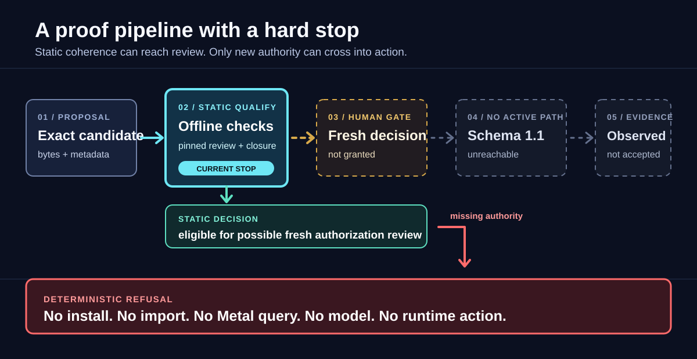
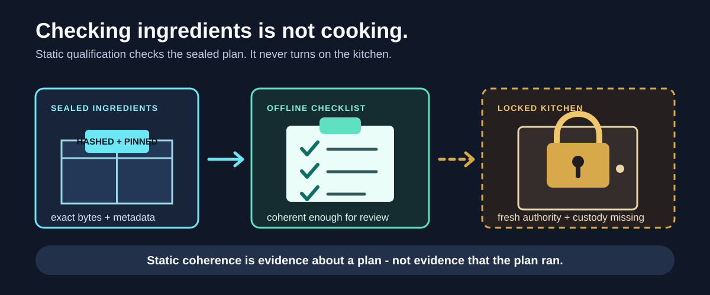
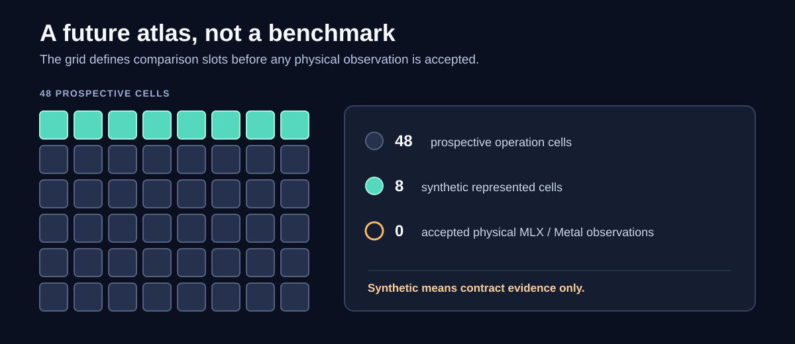

# LocalInferenceLab

**Before local AI can run, prove exactly what would run — and make refusal deterministic.**

<picture>
  <source media="(max-width: 600px)" srcset="docs/assets/readme/qualification-pipeline-mobile.svg" width="600" height="1120">
  
</picture>

> **Current state: static only.** The final qualification record is
> `eligible_for_new_observed_authorization`: eligible for human review toward a
> possible fresh explicit authorization. **No runtime action is authorized.**

## ELI5: Checking Ingredients Is Not Cooking

<picture>
  <source media="(max-width: 600px)" srcset="docs/assets/readme/sealed-kitchen-mobile.svg" width="600" height="1080">
  
</picture>

- **Sealed ingredients** are exact candidate bytes, metadata, source anchors, and hashes.
- **The checklist** verifies their static coherence offline.
- **The locked kitchen** is runtime execution. It still needs a fresh human decision and authoritative custody.

The project proves what it can without quietly crossing that boundary.

## What Is True Now

- **Static decision**<br>
  **Proven:** The canonical record derives `eligible_for_new_observed_authorization` with zero blockers.<br>
  **Not proven:** It authorizes nothing and proves no install, import, runtime, device/Metal, synchronization, or model fact.
- **Pinned candidate**<br>
  **Proven:** Review binds MLX `0.30.4` / MLX-LM `0.30.6`, source evidence, target, 34-wheel closure, pack specification, and prior verified receipt.<br>
  **Not proven:** Offline replay does not prove current wheel presence, native loading, or runtime executability.
- **Execution boundary**<br>
  **Proven:** MLX runtime-preflight schema 1.0 is permanently disabled; schema 1.1 defines a prospective refusal contract.<br>
  **Not proven:** Schema 1.1 has no worker, installer, authorization creator/consumer, or execute entrypoint. It remains unreachable until fresh explicit authorization and custody prerequisites exist.
- **Historical attempt**<br>
  **Proven:** One authorized preflight attempt failed closed and was not retried.<br>
  **Not proven:** Its rejected frame was not retained, so it yielded no accepted runtime facts: no import, backend/device, synchronization, or exact forbidden-action fact.
- **Determinism canary**<br>
  **Proven:** It freezes a 48-cell prospective matrix and exact comparison semantics.<br>
  **Not proven:** Its eight committed positive cases are synthetic only. No physical MLX or Metal observation has been accepted.

## A Map, Not a Measurement

<picture>
  <source media="(max-width: 600px)" srcset="docs/assets/readme/determinism-atlas-mobile.svg" width="600" height="900">
  
</picture>

The canary makes future observations comparable. It does not manufacture them.

## How Trust Flows

**Declare exact inputs** → **replay static checks** → **stop at the human gate** →
**require fresh one-shot authority and bounded custody** → **accept only parent-validated evidence**.

Any mismatch, missing prerequisite, stale claim, or unsupported transition ends in refusal. A hash
binds bytes; it does not create authority.

## Inspect the Evidence

- [Architecture](docs/architecture.md) — what exists, what can act, and what stays process-free
- [Protocol](docs/protocol.md) — which records, gates, counters, and ledgers define trust
- [Direct MLX contract](docs/mlx-direct-runner-contract.md) — the private-worker boundary and its explicit blockers
- [Determinism canary](docs/mlx-determinism-canary.md) — the 48-cell matrix and exact comparison rules
- [Final static qualification record](evidence/mlx-runtime-qualification-mlx-0.30.4-mlx-lm-0.30.6-macos-arm64-py313-v1.json) — the canonical zero-blocker static decision
- [Historical failed-attempt projection](evidence/mlx-runtime-preflight-negative-v1.json) — what the failed preflight retained — and did not retain
- [Current sources](docs/research/current-sources.md) — immutable upstream revisions and claim boundaries
- [MLX static runbook](docs/runbooks/mlx-prospective-study.md) — offline commands and refusal-only custody checks

<details>
<summary>Synthetic refusal-fixture anchors</summary>

- Runtime manifest: `sha256:226617353dc742bda9efa02f6083b3733832659f77add8fb20c4da0e953c31b0`
- Model manifest: `sha256:b29d33d9fba77c827dc62c4b5b83536f65b5b78ad24d3bf5b84cf7379a08ebcf`
- Package: `sha256:7710436299a426d07cb235084a1891db87ed4c810b65a5e5215fba69b6797ddb`
- Bundle: `sha256:fd99954d8c0643719510a8f3b9f3ed15e342bc1f775a3e0d6d2cd37b5e489454`

These identify synthetic contract evidence, not observed runtime behavior.
</details>

Explore the command surface without running a model:

```bash
uv run localinferencelab --help
```

For maintainers, CI's offline entry point is:

```bash
UV_NO_NETWORK=1 make validate
```

---

**The next gate is not “run it.”** It is a fresh human decision backed by authoritative one-shot
authorization and custody that does not exist yet.

Apache-2.0.
