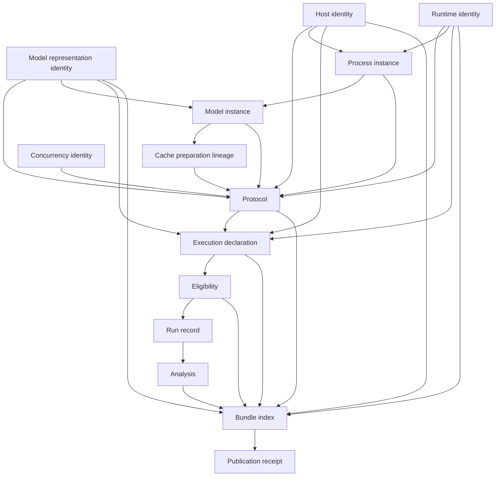

# Architecture

## Design goal

LocalInferenceLab separates experimental intent, permission, observation, custody, and
interpretation. This prevents a result from becoming valid merely because a backend returned text.
Every trust transition is represented by immutable canonical data.

## Components

| Module | Responsibility | Side effects |
|---|---|---|
| `canonical.py` | Strict UTF-8 JSON, duplicate-key rejection, integer-only numeric contract, SHA-256 identities | None |
| `contracts.py` | Versioned dataclasses with unknown-key rejection and semantic validation | None |
| `host.py` | Privacy-preserving host probe through Python APIs, procfs, or `sysctlbyname` | Read-only |
| `backends.py` | Static artifact digest and non-executable backend plans | Read-only |
| `mlx_manifest.py` | Bounded descriptor-relative supplied package/model-root byte-manifest compilers | Explicit local-file reads and manifest writes only; no imports, loads, resolution, process, device, or network |
| `mlx_runner.py` | Pinned direct-worker threat model, finite inherited-descriptor protocol, controls, eligibility, and prospective package | Explicit package writes only; production launch and authorization are absent |
| `mlx_fixture.py` | Deterministic sealed package/model-root byte manifests and ineligible-package replay | Closed-bundle writes only; no fake transport, worker, model, or hardware action |
| `mlx_custody.py` | POSIX supervisor, strict framing/state validation, one-shot inert authorization, physical output-root custody, transcript publication, and process-free replay | One child and one private socketpair only for explicit `custody-self-test`; replay is process/socket-free |
| `mlx_inert_worker.py` | Standalone stdlib refusal-only FD-3 worker | Reads/writes the inherited socket only; no model/backend/network/generated-result surface |
| `mlx_runtime_preflight.py` | Separate exact-runtime lock/receipt validation, schema-1.0 execution gate, synthetic one-shot runtime-preflight custody, strict result/import-closure validation, closed publication, and offline replay | Public `runtime-preflight` validates then rejects the dependency-incompatible observed receipt before physical action; only exact internal synthetic fixtures may start one child/socketpair |
| `mlx_runtime_preflight_worker.py` | Standalone sealed FD-3 runtime-only synthetic worker | After synthetic authorization only, imports bound fake `mlx.core` and `mlx_lm`, queries model-free backend/device/stream facts, and synchronizes; no model action or network/command surface |
| `mlx_qualification.py` | Canonical static candidate package, dependency/marker/wheel assessment, immutable source-only worker-API evidence verification, sole deterministic decision, and two-outcome closed fixture replay | Explicit record/fixture writes only; no install, network, process, socket, authorization, runtime import, backend, model, or spend action |
| `mlx_wheel_custody.py` | Content-addressed exact-wheel closure manifests, bounded no-follow supplied-pack verification, and pack-required qualification reconstruction | Reads caller-supplied wheel ZIP bytes and may write a record only; no install, network, package import, wheel-content execution, process, socket, MLX/Metal, model, or spend action |
| `mlx_preflight_contract.py` | Prospective schema-1.1 model-free protocol/spec, prerequisite/refusal record, bounded inspection, and deterministic closed-fixture replay | Explicit record/fixture writes only; no authorization creation/consumption, install, import, worker, process, socket, backend/device/Metal, synchronization, model, or spend action |
| `mlx_determinism_canary.py` | Prospective operation matrix, exact embedded byte vectors, IEEE comparison metrics, strict synthetic result schema, synthetic atlas, and closed replay | Explicit fixture-bundle writes only; no MLX import, process, authorization, backend/device/Metal query, hardware synchronization, MLX tensor/model action, timing, network, cloud, or spend |
| `ollama.py` | Prospective package, direct numeric-loopback transport, one-shot authorization, bounded execution, terminal custody/replay | Explicit output-root writes; loopback calls only after authorization |
| `ollama_declaration.py` | Canonical multi-run study intent, exact package closure binding, eligibility, and offline declaration fixture replay | Explicit declaration/fixture writes only; no host probe, socket, marker, authorization, or model |
| `ollama_attestation.py` | Pinned listener/runner feasibility requirements, candidate evidence, derived negative verdict, and offline fixture replay | Explicit assessment/fixture writes only; no live process probe, socket, subprocess, Ollama call, authorization, output-root consumption, or model |
| `ollama_fixture.py` | Deterministic accepted/invalid/refused sealed-script evidence | Writes synthetic inputs and closed bundles; no socket or model |
| `analysis.py` | Cohort-isolated exact equality and native metric summaries | None |
| `custody.py` | Closed-set index, atomic publication, verification, replay | Writes only an explicit output root |
| `fixture.py` | Source-custodied synthetic records for two backends | Publishes through custody |
| `cli.py` | Narrow command routing and fail-closed errors | Command-dependent |

No parent module imports an ML framework or downloads/mutates a model. The explicit MLX custody
self-test uses `socket.socketpair` and `os.posix_spawn`; the parent copies the selected interpreter
into a private mode-0500 output-root snapshot, reopens it read-only, and copies verified worker
bytes into an unlinked mode-0400 snapshot. The child executes the exact interpreter copy with the
original fixed `argv[0]`, reads the exact worker object from stdin, verifies the interpreter object
through transient FD 4, then closes FD 4 before reporting its final descriptor set. The separate
runtime-preflight protocol is executable only through exact internal synthetic fixtures: that
worker inherits the bound fake package root at FD 5 and imports it only after its exact synthetic
one-shot authorization is consumed. Public schema-1.0 execution rejects before output-root,
socket/process, authorization, import, or probe action. All static and replay MLX operations remain
process-free. Only
`LoopbackHTTPTransport` can open a socket. An explicit, separately authorized Ollama `preflight`
may use it after output-root and artifact validation. The `execute` surface validates its package
and artifacts but production-refuses before authorization consumption or socket access until the
listening process and active runner/Metal state can be mechanically attested. The attestation
module intentionally imports no socket, subprocess, HTTP transport, host probe, or runtime probe.

The qualification module is also isolated from runtime action. It reads only explicit canonical
candidate/record bytes and closed fixture bundles. Its schema-1.0 package binds exact source
revision/tag provenance, wheel artifact metadata and tags, target Python ABI/macOS/architecture,
exact supplied wheel bytes with embedded METADATA/WHEEL-tag verification, exact raw reviewed
METADATA bytes (or canonical synthetic/projection bytes), bounded `Requires-Dist`,
`Requires-Python`, and marker grammar, the supplied distribution
closure, and immutable source-byte evidence for the future preflight API set. It derives one of
two decisions and cannot construct authorization. Importing the module does not import MLX or
MLX-LM.

The additive wheel-custody module removes the Git-size assumption from real closure evidence. Its
manifest commits exact official artifact URL, filename, size and SHA-256; raw wheel-embedded
METADATA and WHEEL bytes and hashes; dist-info identity; WHEEL tags; selection provenance; source
repository/tag/revision where independently bound; and the complete applicable dependency graph.
The 34 third-party wheel files remain caller supplied and uncommitted. Pack verification opens a
directory and every basename without following links, requires regular single-link members,
rejects missing/extras and ZIP ambiguity, and reconstructs the closure offline. A caller-supplied
content address is sufficient only for generic pack verification. Qualification checks a separate
committed reviewed-manifest allowlist, which is empty in this change; a later review may add the
unchanged manifest ID without mutating the manifest. The manifest and any committed qualification
record explicitly do not attest that a pack was present; reconstruction requires the same supplied
pack.

The determinism canary is a separate pure comparison layer. It decodes only bounded supplied IEEE
payload bytes with Python's standard library. It has no runtime adapter, worker, execution command,
authorization constructor/consumer, model surface, timing field, or hardware-discovery path. Its
pinned operation matrix marks every dtype/evaluation combination `unverified_future_support`.
Exactly eight cells have embedded synthetic representations; 40 cells are prospective only.
Synthetic results copy exact embedded expected bytes and are always labeled
`synthetic_fixture`. Schema 1.0 has no runtime/device/process/authorization identity fields and
rejects physical, authorized-observation, and case-registry records. A future physical-evidence
path requires a distinct schema and closed-bundle verifier; self-asserted hashes are never enough.

## Direct MLX prospective layer

The additive `mlx_runtime_manifest`, `mlx_model_manifest`, `mlx_direct_study_spec`,
`mlx_direct_eligibility`, and `mlx_direct_prospective_package` records are schema 1.0. They do not
change the foundation, Ollama package, declaration, or attestation schemas or identities.

Runtime and model compilers operate only on explicit paths. They traverse from retained directory
descriptors, reject symlinks/special files/hard-link aliases/path injection, enforce fixed depth,
count, path and byte bounds, and store only relative file names plus device/inode/mode/size/digest
identity. The runtime manifest binds the regular-file Python executable, declared
implementation/version/ABI/platform, every direct distribution metadata record and complete byte
closure of the explicitly supplied package root, selected MLX/MLX-LM module-file declarations,
future worker bytes, and a closed environment. Raw `Requires-Dist` headers are recorded but not
evaluated; applicable dependency distributions, the Python standard library, `lib-dynload`,
`libpython`, dynamic loader, native libraries, and frameworks are not proven. The model manifest
binds the complete supplied model-root bytes, materialized config/tokenizer/weight files, exact
present canonical monolith-or-indexed-shard projection, chat-template identity, and absence of
executable/custom/remote code. It does not prove that parameter keys/shapes form a complete
instantiated model.

Static supplied package-root/model evidence remains prospective. The built-in study does not
search for a model and therefore reports no real model manifest. Even when explicit manifests are
supplied, execution is
ineligible pending applicable dependency and Python standard-library/native-loader closure,
production private-IPC/protocol/result-validation implementation, exact memory limits, output-root
binding, one-shot authorization, process birth, active imported-module closure, exact cache
classes, pinned strict model parameter key/shape load evidence, worker-side backend/stream facts,
and final synchronization evidence.

The inert custody protocol removes the listener-authentication gap by making the parent create and
own a one-shot worker and inherited `AF_UNIX` socketpair descriptor. It implements a fixed bounded
canonical-message sequence and forbids bind/listen/accept, DNS, proxies, redirects, arbitrary
commands, shell, unrelated descriptors, retries, warmups, concurrency, and selective reruns. This
milestone implements the process/IPC/state/auth/output-root/refusal path, but intentionally contains
no generated-result producer, MLX import, model load, backend action, or generation authorization.
Replay cross-binds the hello, worker identity, authorization, child wait, process evidence, and
terminal frames; inspection projects eligibility from the same verified bundle snapshot.

The additive runtime-preflight protocol is separate from the frozen inert records. Its synthetic
authorization binds the exact runtime lock, install receipt, runtime manifest, worker/spec/protocol,
allowed probe set, output root, nonces, and wall/monotonic expiry. The synthetic worker starts with
`-I -S -E -s -B`, an exact closed environment, FD 3 control transport, FD 4 transient interpreter
identity, and FD 5 retained runtime root. It reports every imported Python module after imports;
the parent requires every non-stdlib file to match the supplied-root manifest's relative path,
digest, and physical identity. Exact MLX `0.29.3` and MLX-LM `0.30.6` are retained despite the
reviewed MLX-LM Darwin declaration `mlx>=0.30.4`; no newer MLX is substituted, and semantic
dependency closure remains explicitly blocked. That mismatch makes the observed receipt
execution-ineligible for schema 1.0. Public `mlx runtime-preflight` is a pure validation/refusal
surface and no public flag bypasses the gate. A compatible source/version pair requires a
separately reviewed schema and new authorization.

## Static MLX runtime qualification layer

`mlx_runtime_qualification_spec`, `mlx_runtime_qualification_package`, and
`mlx_runtime_qualification_record` are additive schema-1.0 records. They do not change any frozen
foundation, Ollama, direct-MLX, inert-custody, runtime-preflight, protocol, worker, or negative
projection identity.

The package is self-contained and binds exact normalized distribution names/versions, immutable
reviewed source revisions and tags, source provenance URLs, wheel filename/size/SHA-256/URL and
Python/ABI/platform tags, target CPython ABI and macOS version/architecture, exact raw METADATA
bytes and digests, every supplied requirement and marker, one exact `Requires-Python` constraint
for complete metadata, a forbid-all-extras policy, exact `==` top-level MLX/MLX-LM pins,
transitive distributions, and source bytes/digests for each expected future
preflight probe. Potentially eligible candidates must supply exact readable wheel bytes whose
size/digest, embedded METADATA, dist-info identity, and WHEEL tag match the declarations. Public
PyPI and GitHub domains are allowlisted for reviewed candidates; a reserved
`.invalid` domain is accepted only for explicitly synthetic fixtures.

Reviewed worker evidence has a separate canonical specification and independently reviewed anchor.
Each surface binds its authoritative repository, tag, commit, path, full-file SHA-256, exact
line-bounded excerpt bytes and digest, declaration identity, access form, and source-supported
static signature. Static AST/text reconstruction rejects missing or duplicate declarations,
dynamic module/package generation, ambiguous aliases, malformed boolean/integer fields, path or
revision substitution, signature drift, overclaims, self-attested anchors, and coordinated
excerpt rehashing. CPython `v3.13.0` commit
`60403a5409ff2c3f3b07dd2ca91a7a3e096839c7` separately anchors
`importlib.metadata.version(distribution_name) -> str` and its `METADATA["Version"]` access;
that evidence is not attributed to MLX source.

Assessment mechanically evaluates marker applicability and the supported release-version
specifiers, evaluates `Requires-Python` against the exact target `python_full_version`, records
selected dependency versions and exact explanations, computes wheel
compatibility and graph reachability, and requires complete supplied METADATA plus all API evidence.
It fixes every physical/runtime/model counter to zero. The only positive decision,
`eligible_for_new_observed_authorization`, means eligible for human review only. It does not prove
installation, import, runtime/native-loader/stdlib completeness, Metal/device/backend state,
synchronization, model support, or permission. The negative decision carries sorted exact blockers
without fallback.

Candidate-supplied hashes are integrity bindings, not independent review. A real
`reviewed_candidate` is therefore ineligible unless its derived source/wheel/METADATA evidence
anchor is also present in the committed qualification specification. The allowlist retains the
previously merged anchor
`sha256:e4bd7b6f5ce7656d1a490a6e4b39e23e1b9a6acaee55084744a8a267f0007f2c`,
which predates the target mutation. The exact CPython 3.13.15 target plus all seven merged worker
source bindings derive pending anchor
`sha256:1382dfd5e9f5d19bfa74c8f3a7ad4db5b30d10caddfed3cd62c130242003f45f`;
it is intentionally absent from the allowlist pending a later independent review. The package
embeds both exact PyPI wheel byte streams; the validator rechecks their sizes, hashes, dist-info
identities, raw METADATA equality, and WHEEL tags offline. It binds source tags `v0.30.4` and
`v0.30.6` to their exact Git revisions. Its worker-evidence specification and source-evidence
anchor are
`sha256:6c83f627032a2c3db38eee34f804469a42e227a3af0a84ed5c0052a192d29e97`
and `sha256:10ab50cbfb94890bae1dd8c57180645d5781e454b1a8171b158c4d932121d9dd`.
The package is also bound to runtime target anchor
`sha256:008f7c3ac60614bc6909822180a4bc0b9be17eaf0aa3abc23829eb2842c4fdc0`.
The pending anchor is intentionally absent from the allowlist until a later separate review.
That target pins CPython 3.13.15, `cp313`, macOS 27.0.1 build 26A434, the 15.0 runtime-wheel
deployment floor, and arm64.

The target anchor is a trust root, not runtime attestation. It keeps a publishable,
installation-root-relative executable realpath and exact executable/code-signature digests while
omitting the development machine's absolute private path. Its development-host observation proves
only why 3.13.15 is an available prospective choice. The failed historical receipt's 3.13.15
value remains rejected historical evidence, and the superseded 3.13.0 candidate value is not an
allowed fallback. Schema-1.1 prerequisites bind the exact target anchor, while independent future
runtime observation remains unavailable and execution remains unreachable. Caller-supplied
observation claims can validate canonical structure and exact target-field equality only. They
always carry authoritative-observer-identity and custody-bound-measurement blockers and never
become accepted runtime evidence, regardless of caller-selected provenance labels or recomputed
claim IDs.

This is an evidence anchor, not an accepted qualification record. Its derived result is
`ineligible` because the applicable `mlx-metal`, `numpy`, `transformers`, `sentencepiece`,
`protobuf`, `pyyaml`, and `jinja2` distributions remain absent. All seven source/API evidence
blockers are closed, but only at source-surface scope. The `mlx.core` and `mlx_lm` declarations do
not prove import or native-loader success; callable declarations do not prove runtime
executability, device or Metal availability, or synchronization completion. No result record is
committed in the same change. Synthetic fixtures may continue to exercise the positive contract;
historical projections are categorically ineligible and may not relabel partial METADATA as
complete.

Every package binds the frozen schema-1.0 negative projection, runtime lock, terminal failure,
authorization, consumption, historical protocol, and historical worker IDs with
`ids_modified=false`, `retry_authorized=false`, and
`schema_1_0_state=permanently_disabled`. An eligible record still requires a distinct schema-1.1
protocol/spec/worker review and authoritative one-shot authorization custody before any package
installation, network, child/socket, import, backend, Metal, synchronization, or model action.

## Prospective schema-1.1 runtime-preflight contract

`mlx_runtime_preflight_protocol`, `mlx_runtime_preflight_spec`, and
`mlx_runtime_preflight_contract_record` use schema 1.1 and are additive. They do not alter the
schema-1.0 qualification, runtime-preflight, authorization, consumption, terminal-failure, or
negative-projection records. The schema-1.0 state remains permanently disabled.

The protocol and spec are candidate-agnostic. Exact runtime versions and bytes must come from an
eligible schema-1.0 `reviewed_candidate` qualification record whose derived review anchor is in the
committed qualification spec. Strict reconstruction rejects the synthetic-positive fixture,
historical projections, forged decisions, uncommitted anchors, and coordinated rehashing. The
second prerequisite is future authoritative one-shot authorization custody. Acquisition,
current-expiry observation, exclusive consumption/non-reuse, and independently verified
output-root and nonce facts are all unimplemented. A caller may supply an
`mlx_runtime_preflight_authorization_claim` whose canonical structure and internal claimed time
ordering are checked, but every field remains self-asserted. The claim cannot satisfy any
authoritative custody or independent-binding prerequisite.

The contract record keeps execution unreachable regardless of prerequisite state. There is no
schema-1.1 worker, package installer/retriever, authorization creator/consumer, or public/internal
execute entrypoint. Current construction and replay leave `attempted_actions`,
`completed_actions`, and `accepted_evidence` empty and all physical counters zero. Closed fixture
replay deterministically reconstructs refusals for the synthetic eligible qualification and the
historical incompatible qualification; it includes no real candidate, authoritative
authorization, private raw evidence, or private path.

The future physical action contract is deliberately narrower than model execution: exact isolated
runtime-closure verification; imports only of pinned `mlx.core` and `mlx_lm` plus transitive files
from that bound closure; bounded distribution/backend/device/default-stream/Metal metadata; and at
most one default-stream synchronization canary under its own explicit one-shot authorization.
Package retrieval or installation, retries, model/tokenizer discovery or loading, prompts,
cache/inference/generation, tensor allocation or operations, benchmarks, network, cloud, and spend
are forbidden. Attempted actions, completed actions, and strict parent-accepted evidence have
separate claim scopes. Audit hooks may add attempted-action telemetry but are defense in depth, not
an OS sandbox or proof of non-occurrence.

The first authorized observed attempt closed negatively at parent validation of
`preflight_result`. Authorization was consumed, one child was started and reaped, and no retry was
performed. The original failure path discarded the rejected frame after detecting a nonzero
forbidden-action ledger, so the exact audited event and worker-internal phase cannot be recovered
offline. The committed projection therefore accepts no import/backend/device/stream/module-closure
fact, attempted-action category, or completed-forbidden-action claim and closes no
observed-runtime eligibility blocker. It binds the retained terminal, consumption, and
authorization identities and records only the custody rejection path. Updated failure custody
retains a bounded rejected-frame digest/projection and separates `guarded_action_attempts`
(Python-audited network/process-or-command/filesystem-mutation attempts),
`completed_forbidden_actions` (worker-reported completion, required to be zero for acceptance),
and ordinary `model_non_actions`. The audit hook is defense in depth, not an OS sandbox. A rejected
frame is untrusted, so its completed ledger is not accepted as parent proof.

Pinned MLX APIs can report default device, compiled Metal availability, and synchronized stream
completion. They cannot programmatically prove per-kernel Metal dispatch. The eligibility and
result schemas therefore scope any future positive cohort to direct MLX runtime execution with
same-process backend facts, never proven per-kernel GPU execution.

## Runtime-independent MLX determinism canary

The additive `mlx_determinism_canary_spec`, `mlx_determinism_fixture_set`,
`mlx_determinism_result`, `mlx_determinism_comparison`, `mlx_determinism_result_set`, and
`mlx_determinism_atlas` records remain schema 1.0 and do not modify any qualification,
runtime-preflight, worker, authorization, or failure identity. The pinned matrix is the Cartesian
product of eight operation forms, three dtypes, and explicit/deferred evaluation. No cell is
claimed supported. The matrix separately labels eight
`embedded_synthetic_fixture_available` cells and 40 `prospective_only_no_fixture` cells. A
machine-readable future registry contract lists the required unique bindings, but its status is
`unavailable_and_rejected_in_schema_1_0`.

Tensor records bind dtype, shape, byte order, exact lowercase hexadecimal payload, payload SHA-256,
and a canonical descriptor digest under fixed rank/element/byte limits. Comparison refuses
metadata or length drift rather than truncating with `zip` or coercing booleans to integers.
Finite values produce exact binary64-encoded maximum absolute/relative errors and native-format
ULP distance. NaNs require equal sign/payload for numerical equality, infinities require equal
sign, and signed zeros compare numerically equal while their bit difference remains explicit.
The ordered ULP mapping gives positive and negative zero one shared code, so a minimum subnormal
is one ULP from either zero and opposite minimum subnormals are two ULPs apart.

The closed bundle contains the pinned spec, eight embedded operation/edge fixtures, eight copied
synthetic results, recomputed comparisons, and an atlas. Replay reconstructs every nested identity
and rejects coordinated content/index/receipt rehashing that changes pinned semantics. All
verified entries are synthetic fixture-integrity examples. Operation specifications bind every
computation-defining parameter. Cases and results bind the operation-spec identity and concrete
parameters, including axes, keepdims, exact epsilon/initial-accumulator bits, intermediate and
accumulation precision, evaluation/reduction order, fusion behavior, and every rounding stage.
Expected fixture bytes are re-derived with bounded standard-library scalar arithmetic during
verification. A future atlas path must be a new schema that independently verifies every physical
identity and acquisition binding.

## Identity graph

All arrows are SHA-256 references except the final receipt link, which binds the index bytes and
content root after durable publication.

## Authorization boundary

An execution declaration names one protocol, backend, runtime, model, host policy, output root
identity, and action budget. `model_execution_forbidden` requires every budget field to be zero.
Eligibility is separately recorded against exact identities.

Foundation fixture action names remain closed to `model_process_start` and `inference_request`, with
zero network/download budgets. Ollama adds a versioned backend-specific declaration rather than
weakening that schema. It binds eight identity requests, one inference, nine loopback requests,
total request/response bytes, one end-to-end absolute deadline per call,
zero starts/downloads/retries, and one exact schedule.

Two separate one-shot artifacts authorize identity and generation phases. A third phase can
authorize a read-only four-call preflight. The prospective declaration commits distinct nonce
digests before the owner-only nonce files are revealed. Each artifact is content-addressed and
contains the committed nonce preimage; a package exposes only its digest and cannot self-mint the
artifact. One validated output-root descriptor is retained while the artifact is consumed and the
receipt-closed bundle is published. The output marker identity includes local owner/device/inode
state so a copied marker or same-nonce second directory is invalid. Generation is not consumed
until the pre-check passes. Missing or mismatched artifacts fail before output mutation or sockets;
there is no ambient environment or generic network bypass.

The production preflight transport accepts only literal IPv4/IPv6 loopback, direct standard-library
HTTP, fixed paths, one connected peer, no proxy, no redirect, pre-reserved bounded reads, and
one monotonic absolute deadline across connect, peer verification, request send, headers, and body.
It never starts Ollama or mutates a model. The connected-address check is not treated as
listener-process authentication; observed generation remains disabled for that reason.
See
[Ollama runner contract](ollama-runner-contract.md) for the dedicated threat boundary.

## Qwen3 declaration layer

The additive backend-specific `ollama_repeatability_study_declaration` schema 1.0 leaves the
foundation records and runner/package schema 1.0 unchanged. It binds foundation commit
`7f89682bdc50a944cf74e4729f5acffa48dc6f1a`, the runner/package contract versions, known prior
Ollama/Qwen3/host identity, exact prompt and generated request bytes, five ordered attempts, the
four-call metadata preflight, each nine-action run schedule, per-phase nonce commitments when
packages exist, analysis rules, and custody policy.

Exact prospective packages are accepted only as verified canonical values and embedded in the
declaration. Their package/protocol/declaration/runtime/model/host/output-root/nonce identities and
model artifact closure are derived rather than accepted as path or alias strings. Supplying some
but not all scheduled packages fails, as does any cross-repeat runtime, model, host, or output-root
identity change. The single metadata preflight names the first run, its exact package, and its
prospectively committed preflight nonce without creating an authorization. When package artifacts
are unavailable, those package/nonce fields and closure fields are null; missing bindings produce
a valid incomplete declaration rather than fabricated evidence.

Declaration construction never initializes an output root or creates authorization. Metadata
preflight remains separately authorized. Generation and observed-generation replay remain
schema-ineligible with exactly two trust-gate blockers: missing content-bound listener-owner
attestation and missing content-bound active internal runner/Metal attestation. The strict
schema-1.0 declaration remains byte-for-byte compatible with PR #3. The separate assessment binds
that immutable declaration identity and explains why the existing gate remains closed; it does
not revise or migrate the declaration.

## Ollama attestation feasibility layer

The additive `ollama_attestation_feasibility_spec`,
`ollama_attestation_feasibility`, `ollama_attestation_verdict`, and enclosing
`ollama_attestation_assessment` records remain schema 1.0. They bind declaration commit
`8f97e3de113bc334ce6928c3d135edea6fbe3b8c`, immutable built-in declaration identity
`sha256:ebf8c3758c83c353e6e0bd9ab0f12d4aeb30ed9d7c1ed8f20669f7948f30022e`,
pinned Ollama revision
`42e911bc3d05798cad729cb474bf62f378cb2e26`, the exact generation request digest, the declared
IPv4 numeric-loopback endpoint, and a narrow macOS 27.0.1/arm64/non-root/no-special-entitlement
scope. Public XNU source parity with that exact OS build is explicitly not claimed.

The record has three separate layers:

1. Normative requirements cover the exact accepted connection, owner UID and anti-reuse process
   identity, no-follow executable closure, socket continuity, external-request-to-scheduler
   correlation, exact runner/process/model-load identity, model closure, actual Metal execution,
   and continuity through the response.
2. Candidate mechanisms record precise authority and weakness. `libproc`, TCP PCB, and code-signing
   fields are useful observations but do not atomically bind the retained request. `/api/ps`
   exposes load metadata, not runner PID, load-instance identity, backend, Metal state, or request
   dispatch. Pinned internal source shows the required `runnerRef` and child PID exist only inside
   Ollama.
3. The verdict is derived as `insufficient`; all requirements remain missing and both observed
   generation eligibility booleans are fixed false. The schema contains no positive verdict path.

A positive future path needs two cooperating assertions: a privileged kernel mechanism retaining
the accepted socket and stable process/audit identity through response, and reviewed in-process
Ollama evidence that binds the canonical request to one scheduler runner/load instance, runner
artifact/model closure, and actual backend/Metal execution. Those assertions then need one
cryptographic request-scoped chain. A port match, `lsof`, process list, `/api/ps`, argv,
environment, log line, model tag, `size_vram`, or pre/post sample cannot substitute for that chain.

## Atomic publication

Publication follows this order:

1. Reject traversal and symlinks in the existing output-root ancestor chain.
2. Create a private stage directory inside the output root.
3. Create each content file with exclusive, no-follow flags and fsync it.
4. Fsync nested stage directories and the stage root.
5. Move the stage directory with `renameat2(RENAME_NOREPLACE)` on Linux or
   `renamex_np(RENAME_EXCL)` on macOS.
6. Fsync the destination parent.
7. Create `receipt.json` exclusively, fsync it, then fsync the bundle and parent directories.

A destination without a receipt is incomplete and replay rejects it. A collision never replaces
the existing directory. Unsupported platforms fail closed instead of using a racy check-then-rename
fallback. Prefixes are single basenames, reserved index and receipt paths are rejected, and a
runtime receipt-write failure removes the known incomplete destination before allowing a retry.

## Replay closure

The index lists every content file except itself and the receipt. Replay requires exactly the
indexed set plus `index.json` and `receipt.json`, with no extra empty directories. It verifies:

- canonical JSON bytes, duplicate keys, and strict schema keys;
- file sizes and SHA-256 digests;
- receipt, index, and content-root agreement;
- expected record paths so swapped valid records cannot pass;
- strict fixture-source intent and zero-action non-claims;
- protocol allowlists and all identity references;
- exact process/model instances, cache-preparation ancestry, and effective concurrency identity;
- one eligibility result for each declaration;
- every exact protocol schedule slot exactly once, with no relabelling, reordering, duplication, or
  omission;
- forbidden declarations never custody observed execution;
- complete request, host, runtime, model, and action-budget isolation for repeat groups;
- recomputed analysis and receipt summary semantics.

Replay opens the bundle root through descriptor-relative no-follow traversal, then walks and opens
every nested component relative to verified directory descriptors. File opens include nonblocking
and no-follow flags, and `fstat` must identify a regular file before any read. This bounds failure
for FIFOs and rejects sockets, devices, symlinks, replaced path ancestors, foreign ownership, and
group/world-writable bundle directories at every level. Each file is read once, and digest plus
semantic verification use the same byte snapshot. Replay performs no network calls, process
starts, model imports, or model access.

Ollama evidence replay uses the same descriptor-relative `read_closed_bundle` snapshot. It then
rebuilds the request, verifies embedded one-shot authorizations against prospective nonce
commitments, enforces the accepted/invalid/refused state machine and exact schedule, recomputes
reserved/read action totals, requires exactly one indexed bounded response artifact per dispatched
action, reconstructs both identity snapshots from all eight raw identity envelopes, validates every
run identity, regenerates valid response projections, rejects non-producer-reachable invalid
analysis, and checks synthetic side-effect/timing zeros. It also replays preflight bundles as an
exact four-call, zero-generation state machine. The current schema rejects `observed_execution`
generation bundles entirely; a future schema may admit them only when listener-process and active
runner/Metal attestation is required and validated.

Declaration fixture replay is a separate closed-set path. It reconstructs the declaration from its
canonical source specification, recomputes every derived request, schedule, policy, eligibility
decision, identity, and synthetic bundle root, and requires explicit zero physical network, socket,
model, cloud, and spend actions. It does not admit observed evidence.

Attestation fixture replay is another closed-set path. It verifies the pinned source specification,
rebuilds the assessment and every identity, derives the negative verdict, and requires exact zero
counts for live process probes, socket inspection/calls, subprocesses, Ollama requests,
authorization/output-root consumption, model activity, external network, cloud, and spend.
Receipt-consistent coordinated tampering still fails semantic reconstruction.

Physical MLX inert-custody replay is a separate closed-set path. It verifies exact frame bytes and
directions, nonces, package/spec/protocol/worker identities, the sealed worker-source digest,
physical output-root record, authorization expiry and exclusive consumption evidence, refusal-only
result, action/non-action ledger, and parent wait status. It reconstructs blocker splits and keeps
observed generation ineligible. Replay itself performs no socket or process action.

MLX refusal-fixture replay is also closed-set. It rebuilds sealed synthetic runtime and model
manifests, the pinned study specification, and the execution-ineligible package. It requires exact
zero counts for framework imports, Metal/device activity, model/tokenizer loads, inference,
process/subprocess/socket/listener/network actions, downloads, cache mutation, authorization and
output-root consumption, cloud, and spend. Because no safe worker producer exists yet, the fixture
contains no accepted fake execution; it is deterministic refusal-contract evidence only.

## Privacy boundary

Host identity admits architecture, chip name or family, core counts, memory bytes, OS version and
build, and reviewed device facts. It rejects private fact names, absolute or relative home-path
components, and tilde-prefixed home paths. It
does not record usernames, hostnames, home directories, serial numbers, or UUIDs.

Runtime artifact records store a basename and digest, never the source path. Published test data is
synthetic and uses no local host values.
