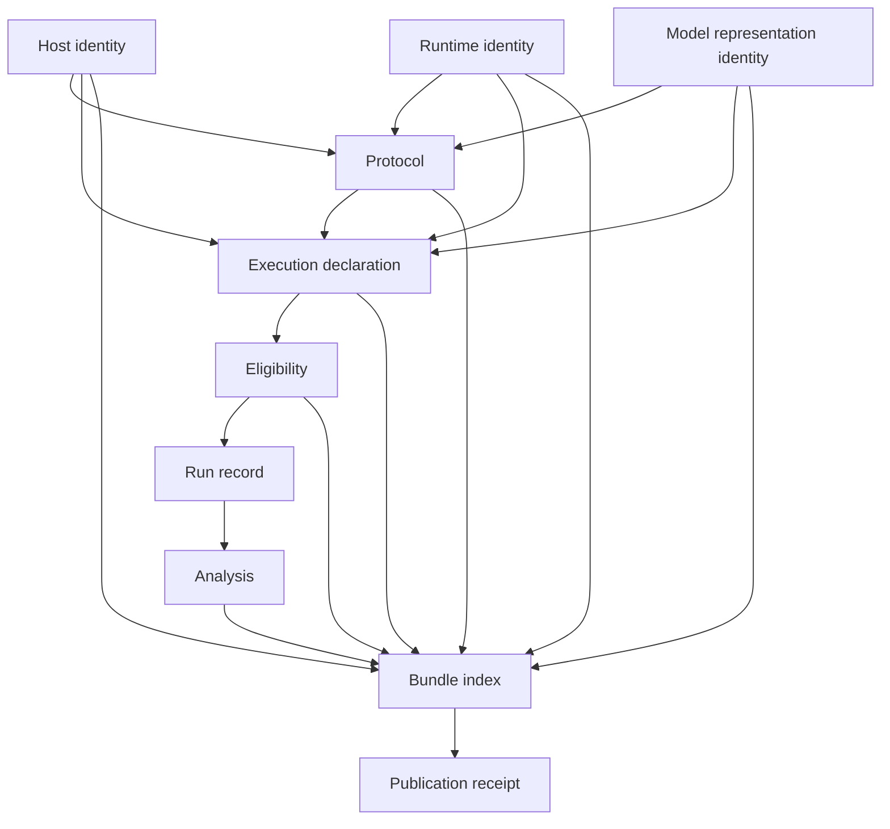

# Architecture

## Design goal

LocalInferenceLab separates experimental intent, permission, observation, custody, and
interpretation. This prevents a result from becoming valid merely because a backend returned text.
Every trust transition is represented by immutable canonical data.

## Components

| Module | Responsibility | Side effects |
|---|---|---|
| `canonical.py` | Strict UTF-8 JSON, duplicate-key rejection, integer-only numeric contract, SHA-256 identities | None |
| `contracts.py` | Versioned dataclasses with unknown-key rejection and semantic validation | None |
| `host.py` | Privacy-preserving host probe through Python APIs, procfs, or `sysctlbyname` | Read-only |
| `backends.py` | Static artifact digest and non-executable backend plans | Read-only |
| `analysis.py` | Cohort-isolated exact equality and native metric summaries | None |
| `custody.py` | Closed-set index, atomic publication, verification, replay | Writes only an explicit output root |
| `fixture.py` | Source-custodied synthetic records for two backends | Publishes through custody |
| `cli.py` | Narrow command routing and fail-closed errors | Command-dependent |

No module imports an ML framework, starts a process, opens a socket, or downloads a model.

## Identity graph

All arrows are SHA-256 references except the final receipt link, which binds the index bytes and
content root after durable publication.

## Authorization boundary

An execution declaration names one protocol, backend, runtime, model, host policy, output root
identity, and action budget. `model_execution_forbidden` requires every budget field to be zero.
Eligibility is separately recorded against exact identities.

V1 action names are closed to `model_process_start` and `inference_request`. Network and download
budgets must always be zero. Observed run records account for each request and process start, and
replay rejects totals above the declaration. Eligibility actions must exactly match positive
budgets rather than caller-provided labels.

The package contains no live execution implementation. This makes accidental execution impossible
rather than merely discouraged. A future runner must:

1. accept a declaration as a separate input;
2. recompute every referenced identity before any model process or API action;
3. reject wildcard identities, ambient environment overrides, and output-root drift;
4. account for every process start, inference request, network request, and download before action;
5. support only preinstalled, local resources;
6. emit digest-safe invalid records on failure.

Adding a runner is a protocol change and requires dedicated threat review.

## Atomic publication

Publication follows this order:

1. Reject traversal and symlinks in the existing output-root ancestor chain.
2. Create a private stage directory inside the output root.
3. Create each content file with exclusive, no-follow flags and fsync it.
4. Fsync nested stage directories and the stage root.
5. Move the stage directory with `renameat2(RENAME_NOREPLACE)` on Linux or
   `renamex_np(RENAME_EXCL)` on macOS.
6. Fsync the destination parent.
7. Create `receipt.json` exclusively, fsync it, then fsync the bundle and parent directories.

A destination without a receipt is incomplete and replay rejects it. A collision never replaces
the existing directory. Unsupported platforms fail closed instead of using a racy check-then-rename
fallback. Prefixes are single basenames, reserved index and receipt paths are rejected, and a
runtime receipt-write failure removes the known incomplete destination before allowing a retry.

## Replay closure

The index lists every content file except itself and the receipt. Replay requires exactly the
indexed set plus `index.json` and `receipt.json`, with no extra empty directories. It verifies:

- canonical JSON bytes, duplicate keys, and strict schema keys;
- file sizes and SHA-256 digests;
- receipt, index, and content-root agreement;
- expected record paths so swapped valid records cannot pass;
- strict fixture-source intent and zero-action non-claims;
- protocol allowlists and all identity references;
- one eligibility result for each declaration;
- contiguous run order and protocol cache cohorts;
- forbidden declarations never custody observed execution;
- complete request, host, runtime, model, and action-budget isolation for repeat groups;
- recomputed analysis and receipt summary semantics.

Replay opens each file without following its final symlink, reads it once, and performs digest and
semantic verification from the same byte snapshot. It performs no network calls, process starts,
model imports, or model access.

## Privacy boundary

Host identity admits architecture, chip name or family, core counts, memory bytes, OS version and
build, and reviewed device facts. It rejects private fact names and common home-path prefixes. It
does not record usernames, hostnames, home directories, serial numbers, or UUIDs.

Runtime artifact records store a basename and digest, never the source path. Published test data is
synthetic and uses no local host values.
