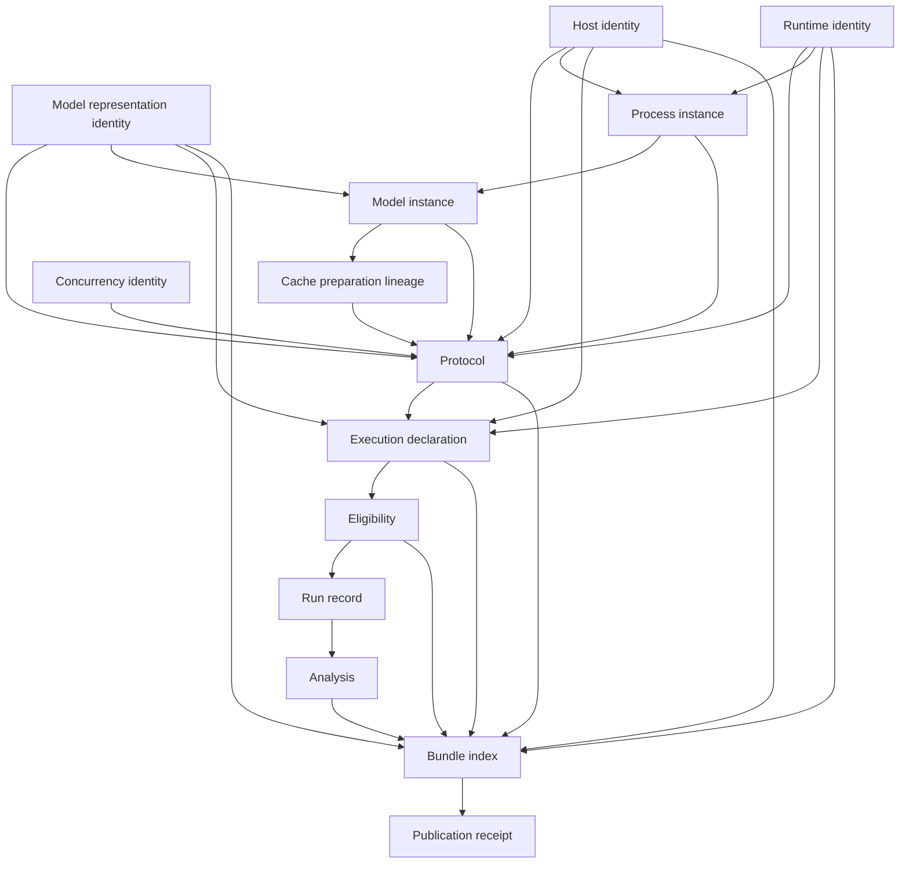

# Architecture

## Design goal

LocalInferenceLab separates experimental intent, permission, observation, custody, and
interpretation. This prevents a result from becoming valid merely because a backend returned text.
Every trust transition is represented by immutable canonical data.

## Components

| Module | Responsibility | Side effects |
|---|---|---|
| `canonical.py` | Strict UTF-8 JSON, duplicate-key rejection, integer-only numeric contract, SHA-256 identities | None |
| `contracts.py` | Versioned dataclasses with unknown-key rejection and semantic validation | None |
| `host.py` | Privacy-preserving host probe through Python APIs, procfs, or `sysctlbyname` | Read-only |
| `backends.py` | Static artifact digest and non-executable backend plans | Read-only |
| `ollama.py` | Prospective package, direct numeric-loopback transport, one-shot authorization, bounded execution, terminal custody/replay | Explicit output-root writes; loopback calls only after authorization |
| `ollama_fixture.py` | Deterministic accepted/invalid/refused fake-transport evidence | Writes synthetic inputs and closed bundles; no socket or model |
| `analysis.py` | Cohort-isolated exact equality and native metric summaries | None |
| `custody.py` | Closed-set index, atomic publication, verification, replay | Writes only an explicit output root |
| `fixture.py` | Source-custodied synthetic records for two backends | Publishes through custody |
| `cli.py` | Narrow command routing and fail-closed errors | Command-dependent |

No module imports an ML framework, starts a process, or downloads/mutates a model. Only
`LoopbackHTTPTransport` can open a socket. An explicit, separately authorized Ollama `preflight`
may use it after output-root and artifact validation. The `execute` surface validates its package
and artifacts but production-refuses before authorization consumption or socket access until the
listening process and active runner/Metal state can be mechanically attested.

## Identity graph

All arrows are SHA-256 references except the final receipt link, which binds the index bytes and
content root after durable publication.

## Authorization boundary

An execution declaration names one protocol, backend, runtime, model, host policy, output root
identity, and action budget. `model_execution_forbidden` requires every budget field to be zero.
Eligibility is separately recorded against exact identities.

Foundation fixture action names remain closed to `model_process_start` and `inference_request`, with
zero network/download budgets. Ollama adds a versioned backend-specific declaration rather than
weakening that schema. It binds eight identity requests, one inference, nine loopback requests,
total request/response bytes, per-call timeout, zero starts/downloads/retries, and one exact
schedule.

Two separate one-shot artifacts authorize identity and generation phases. A third phase can
authorize a read-only four-call preflight. The prospective declaration commits distinct nonce
digests before the owner-only nonce files are revealed. Each artifact is content-addressed and
contains the committed nonce preimage; a package exposes only its digest and cannot self-mint the
artifact. One validated output-root descriptor is retained while the artifact is consumed and the
receipt-closed bundle is published. The output marker identity includes local owner/device/inode
state so a copied marker or same-nonce second directory is invalid. Generation is not consumed
until the pre-check passes. Missing or mismatched artifacts fail before output mutation or sockets;
there is no ambient environment or generic network bypass.

The production preflight transport accepts only literal IPv4/IPv6 loopback, direct standard-library
HTTP, fixed paths, one connected peer, no proxy, no redirect, pre-reserved bounded reads, and
explicit deadlines. It never starts Ollama or mutates a model. The connected-address check is not
treated as listener-process authentication; observed generation remains disabled for that reason.
See
[Ollama runner contract](ollama-runner-contract.md) for the dedicated threat boundary.

## Atomic publication

Publication follows this order:

1. Reject traversal and symlinks in the existing output-root ancestor chain.
2. Create a private stage directory inside the output root.
3. Create each content file with exclusive, no-follow flags and fsync it.
4. Fsync nested stage directories and the stage root.
5. Move the stage directory with `renameat2(RENAME_NOREPLACE)` on Linux or
   `renamex_np(RENAME_EXCL)` on macOS.
6. Fsync the destination parent.
7. Create `receipt.json` exclusively, fsync it, then fsync the bundle and parent directories.

A destination without a receipt is incomplete and replay rejects it. A collision never replaces
the existing directory. Unsupported platforms fail closed instead of using a racy check-then-rename
fallback. Prefixes are single basenames, reserved index and receipt paths are rejected, and a
runtime receipt-write failure removes the known incomplete destination before allowing a retry.

## Replay closure

The index lists every content file except itself and the receipt. Replay requires exactly the
indexed set plus `index.json` and `receipt.json`, with no extra empty directories. It verifies:

- canonical JSON bytes, duplicate keys, and strict schema keys;
- file sizes and SHA-256 digests;
- receipt, index, and content-root agreement;
- expected record paths so swapped valid records cannot pass;
- strict fixture-source intent and zero-action non-claims;
- protocol allowlists and all identity references;
- exact process/model instances, cache-preparation ancestry, and effective concurrency identity;
- one eligibility result for each declaration;
- every exact protocol schedule slot exactly once, with no relabelling, reordering, duplication, or
  omission;
- forbidden declarations never custody observed execution;
- complete request, host, runtime, model, and action-budget isolation for repeat groups;
- recomputed analysis and receipt summary semantics.

Replay opens the bundle root through descriptor-relative no-follow traversal, then walks and opens
every nested component relative to verified directory descriptors. File opens include nonblocking
and no-follow flags, and `fstat` must identify a regular file before any read. This bounds failure
for FIFOs and rejects sockets, devices, symlinks, replaced path ancestors, foreign ownership, and
group/world-writable bundle directories at every level. Each file is read once, and digest plus
semantic verification use the same byte snapshot. Replay performs no network calls, process
starts, model imports, or model access.

Ollama evidence replay uses the same descriptor-relative `read_closed_bundle` snapshot. It then
rebuilds the request, verifies embedded one-shot authorizations against prospective nonce
commitments, enforces the accepted/invalid/refused state machine and exact schedule, recomputes
reserved/read action totals, validates identity snapshots and every run identity, links action 5 to
the preserved response bytes, regenerates valid response projections, and checks synthetic
side-effect/timing zeros. It also replays preflight bundles as an exact four-call, zero-generation
state machine. The current schema rejects `observed_execution` generation bundles entirely; a
future schema may admit them only when listener-process and active runner/Metal attestation is
required and validated.

## Privacy boundary

Host identity admits architecture, chip name or family, core counts, memory bytes, OS version and
build, and reviewed device facts. It rejects private fact names, absolute or relative home-path
components, and tilde-prefixed home paths. It
does not record usernames, hostnames, home directories, serial numbers, or UUIDs.

Runtime artifact records store a basename and digest, never the source path. Published test data is
synthetic and uses no local host values.
